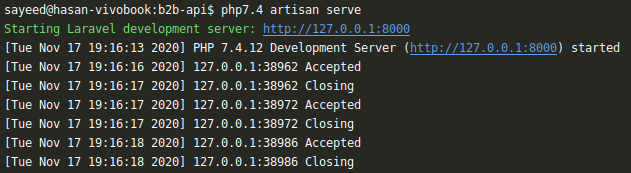

Lumen Serve in Artisan
===================

Serve the application on the PHP development server.

----------

Installation
-------------
Via Composer

``` bash
$ composer require sayeed/lumen-serve
```

Open bootstrap/app.php and add the line below

```php
$app->register(Sayeed\LumenServe\LumenServeProvider::class);
```

<hr/>

### **Uses**
1. Run `php artisan serve` to serve the application on the PHP development server




### **License**
The **lumen-serve** is a open-source software licensed under the [MIT License](LICENSE.md).


## Credits

- [Md. Hasan Sayeed](https://github.com/jbhasan)

 For any questions, you can reach out to the author of this package, Md. Hasan Sayeed.

 Thank you for using it :)
